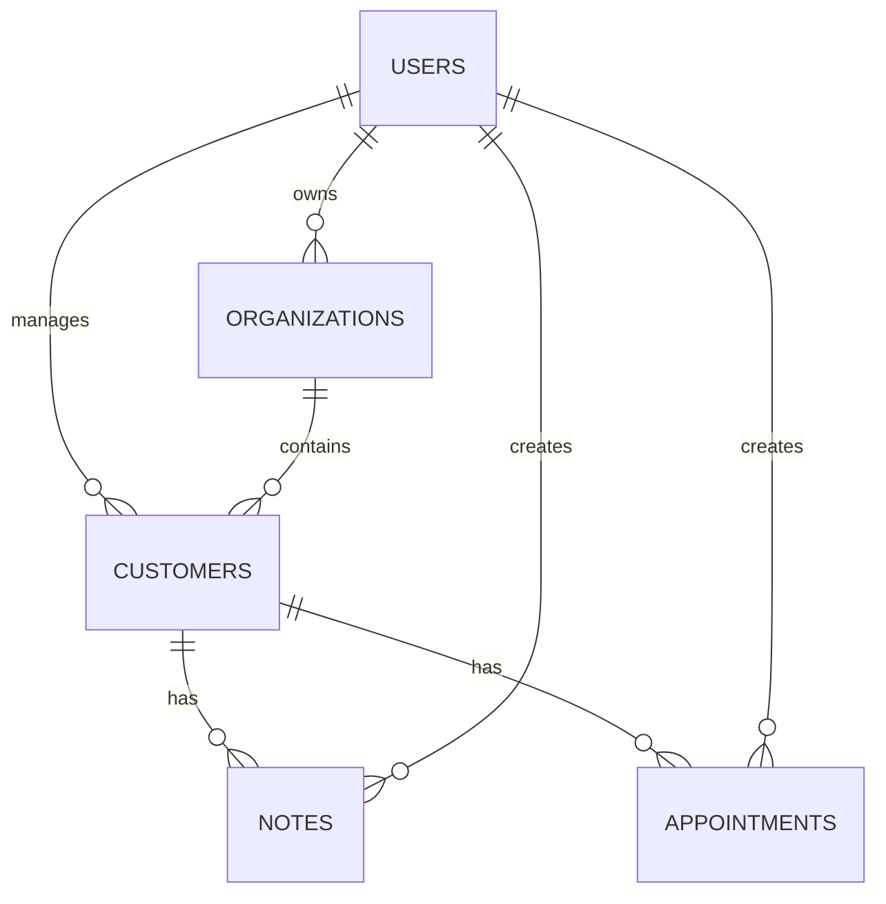

# Modelagem real do banco de dados

## Decisao principal

O projeto passa a usar MongoDB com Mongoose como banco real, mantendo o `json-server` apenas como mock de desenvolvimento. A modelagem segue uma abordagem document-oriented disciplinada: documentos separados por colecao, referencias claras entre entidades, indices para consultas frequentes e preparacao para uso comercial.

## Objetivos da modelagem

- Separar dados por usuario e, futuramente, por organizacao/empresa.
- Evitar documentos gigantes, especialmente em historicos de notas.
- Permitir busca rapida por clientes, notas e agenda.
- Manter caminho simples de migracao do `backend/db.json` para MongoDB.
- Preparar bases para LGPD: rastreabilidade, exclusao logica e consulta dos dados do titular.

## Colecoes

### users

Representa a conta que acessa o sistema.

Campos principais:

- `name`: nome do usuario, profissional ou empresa.
- `document`: CPF/CNPJ ou identificador fiscal, opcional nesta fase.
- `email`: login principal, unico.
- `passwordHash`: senha protegida por hash.
- `role`: perfil inicial (`owner`, `admin`, `member`).
- `status`: estado da conta (`active`, `inactive`).
- `passwordResetTokenHash`: hash do token de recuperacao de senha.
- `passwordResetExpiresAt`: expiracao do token.
- `lastLoginAt`: ultimo login.
- `deletedAt`: exclusao logica.

Indices:

- `email` unico.
- `status`.
- `deletedAt`.

### organizations

Representa uma empresa/workspace. Mesmo que a primeira versao use apenas um usuario dono, essa colecao evita refatoracao pesada se o produto virar multiusuario.

Campos principais:

- `name`: nome da empresa ou workspace.
- `ownerId`: usuario dono.
- `status`: estado da organizacao.
- `deletedAt`: exclusao logica.

Indices:

- `ownerId`.
- `status`.

### customers

Representa os clientes cadastrados pelo usuario ou organizacao.

Campos principais:

- `organizationId`: workspace dono do cliente.
- `ownerId`: usuario que criou/gerencia o cliente.
- `name`: obrigatorio.
- `phone`: opcional.
- `email`: opcional.
- `socialProfile`: opcional.
- `birthDate`: opcional.
- `observation`: observacao geral.
- `status`: `active` ou `archived`.
- `deletedAt`: exclusao logica.

Indices:

- `{ organizationId, name }`.
- `{ ownerId, name }`.
- `phone`.
- `email`.
- `deletedAt`.

### notes

Representa anotacoes/historico de atendimento de um cliente. Fica em colecao separada para evitar que um cliente com muitas anotacoes vire um documento grande demais.

Campos principais:

- `organizationId`: workspace.
- `ownerId`: usuario dono.
- `customerId`: cliente relacionado.
- `date`: data da anotacao.
- `title`: obrigatorio.
- `content`: texto da anotacao.
- `deletedAt`: exclusao logica.

Indices:

- `{ customerId, date }`.
- `{ ownerId, date }`.
- `{ organizationId, date }`.
- `deletedAt`.

### appointments

Representa agendamentos vinculados a clientes.

Campos principais:

- `organizationId`: workspace.
- `ownerId`: usuario dono.
- `customerId`: cliente relacionado.
- `date`: data do atendimento.
- `time`: horario no formato `HH:mm`.
- `description`: detalhes do atendimento.
- `status`: `scheduled`, `completed`, `cancelled` ou `no_show`.
- `deletedAt`: exclusao logica.

Indices:

- `{ ownerId, date, time }`.
- `{ organizationId, date, time }`.
- `{ customerId, date }`.
- `status`.
- `deletedAt`.

## Relacionamentos

## Decisoes de boas praticas

- Notas e agendamentos ficam fora de `customers`, ligados por `customerId`.
- Dados comerciais sempre recebem `ownerId`; `organizationId` fica preparado para multiempresa.
- Exclusao usa `deletedAt` para permitir auditoria e futuras regras LGPD.
- Senha nunca e salva em texto puro; apenas `passwordHash`.
- Recuperacao de senha usa token salvo apenas em hash.
- Consultas da interface devem filtrar por `deletedAt: null`.
- Quando houver backend autenticado completo, os dados devem ser filtrados pelo usuario logado.

## Compatibilidade com o frontend atual

Por enquanto, as rotas do backend real mantem os endpoints usados pelo frontend:

- `GET /customers`
- `POST /customers`
- `GET /customers/:id`
- `PUT /customers/:id`
- `DELETE /customers/:id`
- `GET /notes?customerId=...`
- `POST /notes`
- `GET /notes/:id`
- `PUT /notes/:id`
- `DELETE /notes/:id`
- `GET /appointments`
- `POST /appointments`
- `PUT /appointments/:id`
- `DELETE /appointments/:id`

As rotas de autenticacao reais ficam disponiveis em:

- `POST /auth/register`
- `POST /auth/login`
- `GET /auth/me`
- `POST /auth/forgot-password`
- `POST /auth/reset-password`

## Evolucao futura recomendada

- Trocar `ownerId` padrao de desenvolvimento pelo usuario autenticado em todas as rotas.
- Adicionar envio real de e-mail para recuperacao de senha.
- Criar permissao por organizacao quando houver equipe.
- Implementar exportacao e exclusao de dados pessoais para LGPD.
- Avaliar campos customizados por segmento de negocio quando o produto amadurecer.
